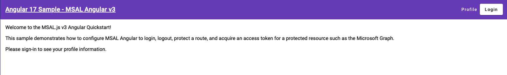
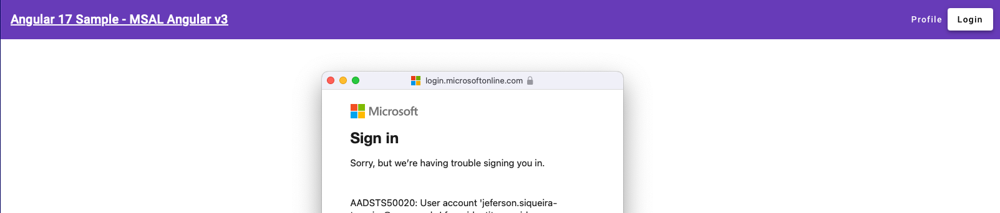
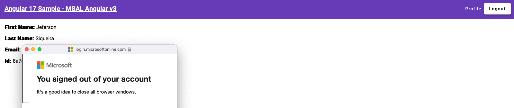

# Angular17MicrosoftAuthenticator

This project was generated with [Angular CLI](https://github.com/angular/angular-cli) version 17.3.8.

## Development server

Run `ng serve` for a dev server. Navigate to `http://localhost:4200/`. The application will automatically reload if you change any of the source files.

## Code scaffolding

Run `ng generate component component-name` to generate a new component. You can also use `ng generate directive|pipe|service|class|guard|interface|enum|module`.

## Build

Run `ng build` to build the project. The build artifacts will be stored in the `dist/` directory.

## Login Test

Home - Before Login

Login - Failed (wrong user)

Login - Success (correct user)

Logout - Success (correct user)

## Further help

To get more help on the Angular CLI use `ng help` or go check out the [Angular CLI Overview and Command Reference](https://angular.io/cli) page.

